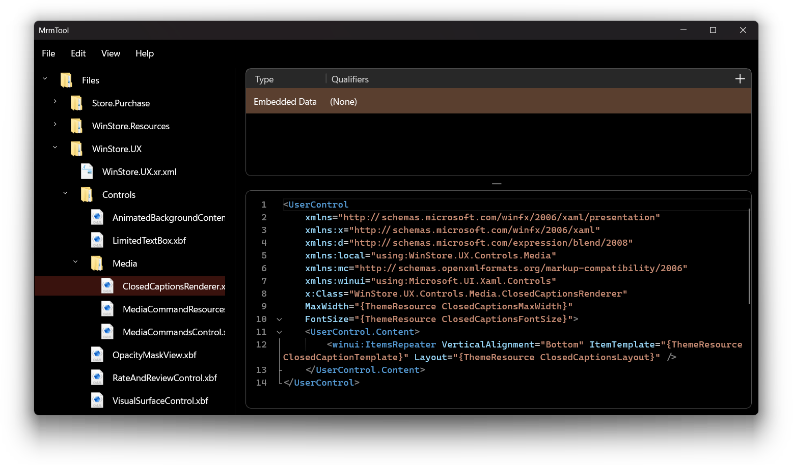

# MrmTool

**MrmTool** is a tool for viewing and editing **PRI** files, it allows you to create, modify, and remove **PRI** resources as well as previewing their contents.

**MrmTool** relies on [MrmLib](https://github.com/ahmed605/MrmLib) for processing and modifying **PRI** files.

It also includes a versioned **XBF** (XAML Binary Format) decompiler and recompiler. It can decompile XBF v1, v2, and v2.1 to XAML, compile XAML to those versions, and reserialize an existing XBF document without passing through XAML.

**MrmTool** supports the following **PRI** versions:

- Windows 8 (`mrm_pri0`)
- Windows 8.1 (`mrm_pri1`)
- Windows Phone 8.1 (`mrm_prif`)
- UWP (`mrm_pri2`)
- UWP RS4+ (`mrm_pri3`)
- Windows App SDK / WinUI 3 (`mrm_pri3`)
- UWP vNext (`mrm_vnxt`)

### Screenshot

